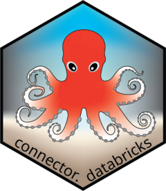

<!-- README.md is generated from README.Rmd. Please edit that file -->

# connector.databricks <a href="https://novonordisk-opensource.github.io/connector.databricks"></a>

<!-- badges: start -->

[](https://github.com/novonordisk-opensource/connector.databricks/actions/workflows/check_and_co.yaml)
[](https://lifecycle.r-lib.org/articles/stages.html#experimental)
<!-- badges: end -->

The connector.databricks package provides a convenient interface for
accessing and interacting with Databricks volumes and tables directly
from R. This vignette will guide you through the process of connecting
to databricks, retrieving data, and performing various operations using
this package.

This package is meant to be used with {connector} package, which
provides a common interface for interacting with various data sources.
The connector.databricks package extends the connector package to
support Databricks **volumes** and **tables**.

## Installation

You can install the connector.databricks package using the following
command:

``` r
# Install from CRAN
install.packages("connector.databricks")

# Alternatively, you can install the development version from GitHub:
devtools::install_github("novonordisk-opensource/connector.databricks")
```

## Usage

Package is meant to be used alongside connector package, but it can be
used independently as well. Here is an example of how to connect to
databricks and retrieve data:

``` r
library(connector.databricks)

# Connect to databricks tables using DBI
con <- connector_databricks_table(
  httpPath = "path-to-cluster",
  catalog = "my_catalog",
  schema = "my_schema"
)

# Connect to databricks volume
con <- connector_databricks_volume(
  catalog = "my_catalog",
  schema = "my_schema",
  path = "path-to-file-storage"
)
```

When connecting to **Databricks tables**, authentication to databricks
is handled by the `odbc::databricks()` driver and supports general use
of personal access tokens and credentials through Posit Workbench. See
also `odbc::databricks()` On more information on how the connection to
Databricks is established.

When connecting to **Databricks volumes**, authentication is handled
using `DatabricksClient()` function, whenever a call to the API is made.
Environments should have configurations available via the environment
variable `DATABRICKS_CONFIG_FILE` or located at `~/.databrickscfg` in
order for this to work. For more info have a look at the function
documentation.

Both types of connections share similar interfaces for reading and
writing data. Tables should be used with tabular types of data, while
volumes should be used with unstructured data.

Example of how to use the connector object:

``` r
# List content
con$list_content_cnt()

# Write a file
con$write_cnt(iris, "iris.rds")

# Read a file
con$read_cnt("iris.rds") |>
  head()

# Remove a file
con$remove_cnt("file_name.csv")
```

## Usage with connector package

Here is an example how it can be used with connector package and
configuration YAML file (for more information take a look at the
connector package):

``` r
# Connect using configuration file
connector <- connector::connect(
  config = system.file(
    "config",
    "example_yaml.yaml",
    package = "connector.databricks"
  )
)

# List contents in Volume
connector$volumes$list_content_cnt()

# Get databricks connection object from Tables
connector$tables$get_conn()

# Write a file
connector$volumes$write_cnt(iris, "Test/iris.csv")

# Read a file
connector$tables$read_cnt("example_data")
```

## Contributing

We welcome contributions to the connector.databricks package. If you
have any suggestions or find any issues, please open an issue or submit
a pull request on GitHub.

## License

This package is licensed under the Apache License.
